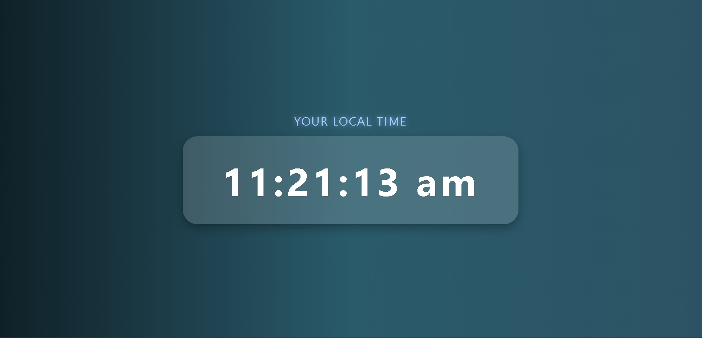

# 🕒 Digital Clock

This is a simple and good-looking digital clock made with **HTML**, **CSS**, and **JavaScript**.

It shows your **local time** on the screen and updates every second — just like a real clock!

---

## 📸 Screenshot

  
*(Make sure you have a file named `screenshot.png` in the folder so this image shows up.)*

---

## ✨ What This Clock Does

- Shows the current time on your screen ⏰
- Works on phones, tablets, and computers 📱💻
- Looks modern and clean 🎨
- Made without any extra libraries — just HTML, CSS, and JavaScript!

---

## 🧠 What I Learned

- How to get the current time using JavaScript
- How to update the screen every second
- How to change the page using JavaScript and the DOM
- How to use Flexbox and gradient backgrounds in CSS
- How to make a simple web project look good on all screen sizes

---

## 🚀 How to Use It

1. Download or clone this project
2. Open the file `index.html` in your web browser
3. That’s it! You’ll see the digital clock running

---

## 🔗 Live Demo

👉 [Live Demo](https://digital-clock-six-hazel.vercel.app/)   

---

## 🙋‍♂️ Made By

Created by **Nakul Bana**
